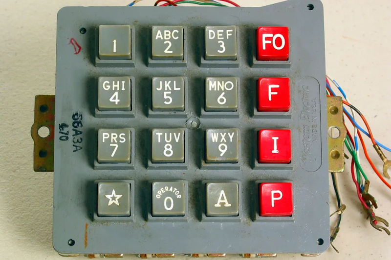
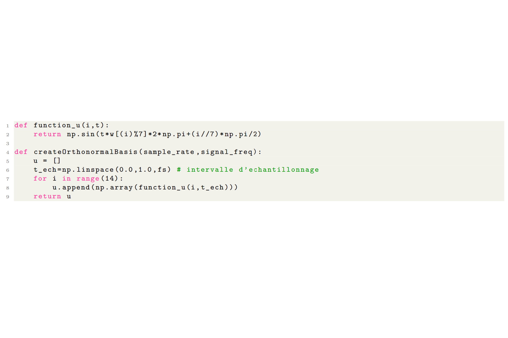
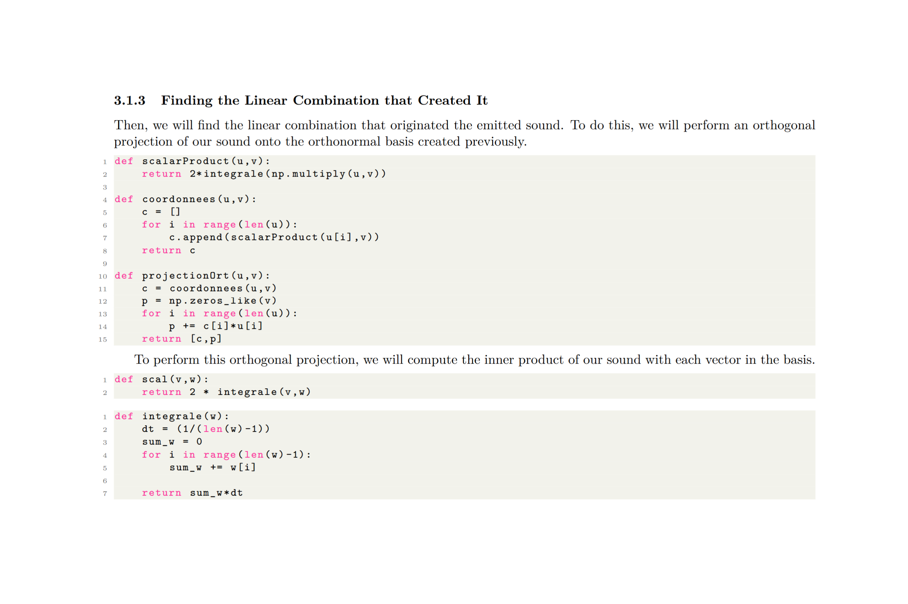
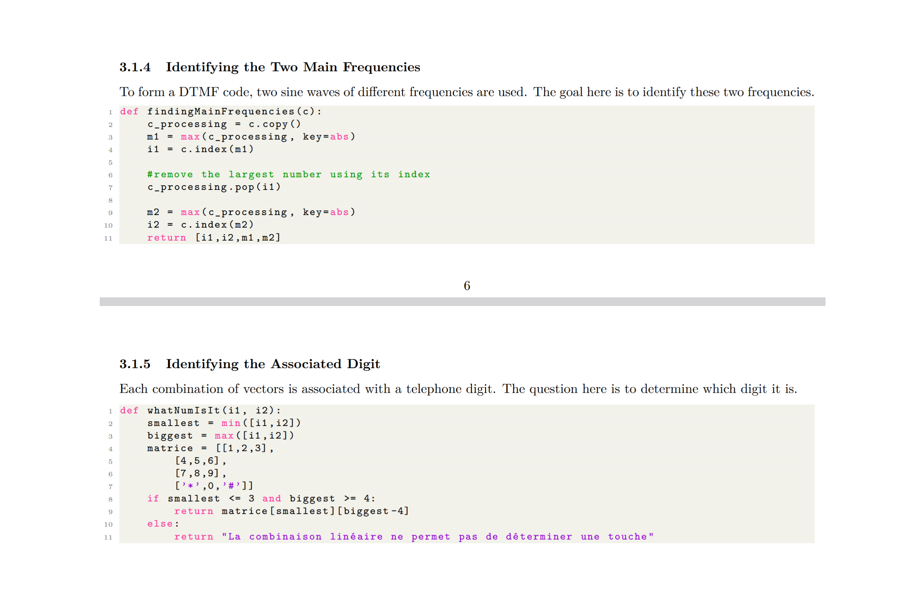

# DtmfCodeAnalyzer

## 🚀 Overview

**DtmfCodeAnalyzer** is an open-source project designed to analyze and filter DTMF (Dual-Tone Multi-Frequency) signals used in conventional telephony. The project provides functionalities to detect and identify keypresses from audio recordings, as well as remove DTMF tones to isolate voice signals.

## 🎯 Purpose
- 🎵 **DTMF Signal Recognition**: Identify the key pressed based on the audio recording of its emitted frequencies.
- 🔇 **DTMF Noise Removal**: Extract and suppress DTMF tones from an audio sample to reveal underlying speech.
- 📊 **Mathematical Approach**: Use vector projection in an Euclidean space to determine the closest frequency matches.

## 📝 Features
| 🏷️ Feature        | 🔍 Description |
|----------------|-------------|
| 🎛️ **DTMF Frequencies** | Combination of two distinct tones per key |
| 🎚️ **Key Identification** | Detects and determines the key pressed |
| 🔊 **Noise Filtering** | Removes DTMF tones while preserving speech |
| 📉 **Mathematical Model** | Projects signals into a vector space for analysis |
| 🎤 **Audio Processing** | Works with recorded audio samples |
| 🖥️ **Open-Source** | Fully customizable and modifiable |

## 📐 Signal Processing Approach
| 🎵 Frequency Vector Representation | 🧮 Euclidean Projection | 🎛️ Filtering |
|-----------|-----------|-----------|
|  |  |  |

## 🌟 License
This project is open-source. Feel free to use, modify, and contribute! 🚀
